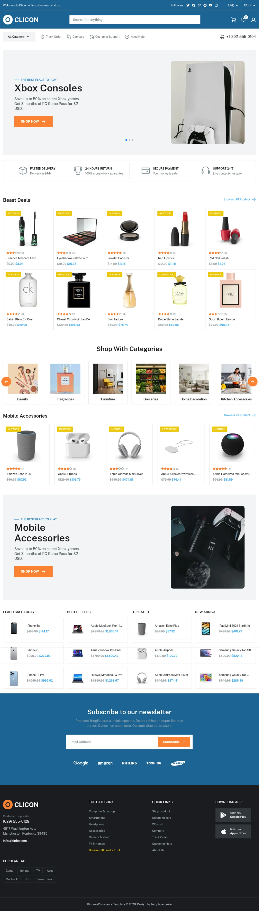
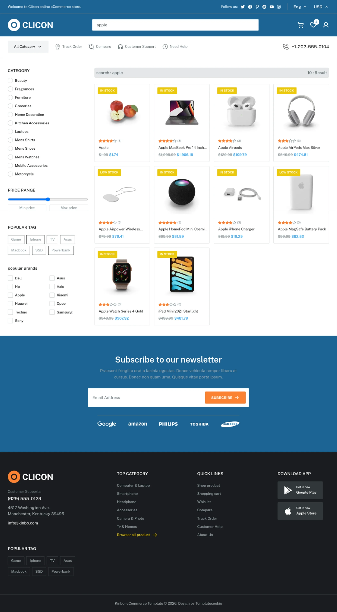

# Clicon E-Commerce Marketplace


## 🎨 Design Preview

Here is the design layout preview for the Clicon E-Commerce Marketplace:

<div align="center">
  <table border="0">
    <tr>
      <td></td>
      <td></td>
    </tr>
    <tr>
      <td></td>
      <td></td>
    </tr>
    <tr>
      <td colspan="2" align="center"></td>
    </tr>
  </table>
</div>

---

## 📝 About

A modern, fully responsive e-commerce marketplace built with **Next.js 16**, **React 19**, and **Tailwind CSS v4**. Features fluid animations with **Motion** and touch-optimized sliders using **Swiper**.

---

## 🚀 Features & Tech Stack

### Core Technologies

- **Framework:** Next.js 16 (App Router) & React 19
- **Styling:** Tailwind CSS v4 & PostCSS
- **State Management:** Zustand
- **Data Fetching:** Axios

### Libraries & UI Components

- **Animations:** Motion (Framer Motion)
- **Slider/Carousel:** Swiper
- **Icons:** React Icons
- **Utilities:** `clsx`, `tailwind-merge`, `class-variance-authority` (CVA)
- **Compiler Optimization:** Babel Plugin React Compiler

---

## ⚙️ Getting Started

### Prerequisites

This project uses **pnpm** as its package manager. Make sure you have it installed globally:

````bash

npm install -g pnpm

Installation
Clone this repository:

Bash
git clone [https://github.com/your-username/clicon-ecommerce-marketplace.git](https://github.com/your-username/clicon-ecommerce-marketplace.git)
Navigate to the project directory:

Bash
cd clicon-ecommerce-marketplace
Install the dependencies:

Bash
pnpm install
Development Server
Run the local development server:

Bash
pnpm dev
Open http://localhost:3000 in your browser to see the result.

Production Build
To create an optimized production build:

Bash
pnpm build
To run the production build locally:

Bash
pnpm start
Linting
To run ESLint and check for code quality issues:
pnpm lint

```bash
````
